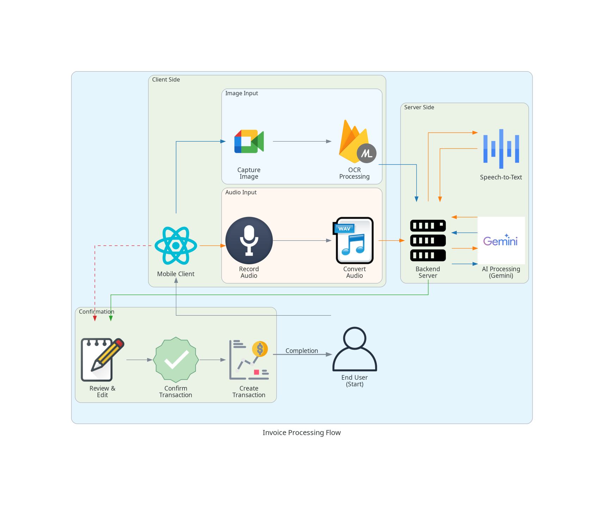
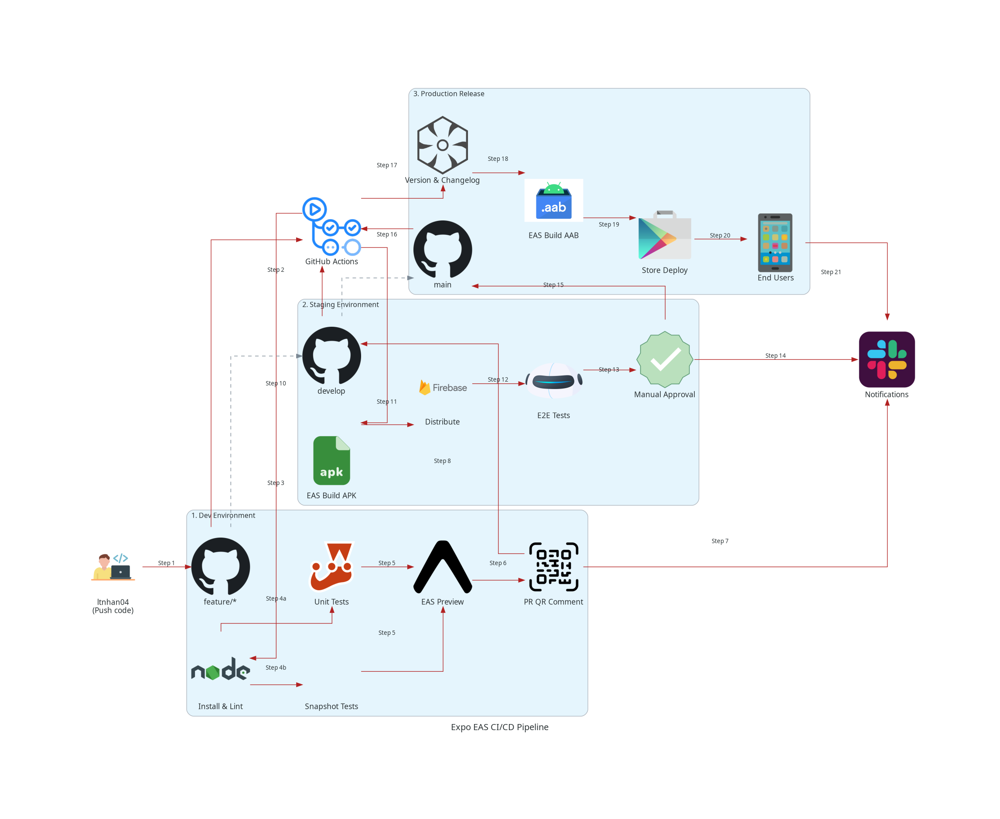

# ViFin: Finance Assist ✨

<div align="center">
  
  
  > Your Smart Financial Companion 📱💰


</div>

## 📱 Quick Overview

ViFin revolutionizes personal finance management with AI-powered features and intuitive design. Transform your receipts into insights, track expenses effortlessly, and make smarter financial decisions.

## 🎬 Key Features & Demo

### ✨ App Overview

<div align="center">

  <a href="https://res.cloudinary.com/durjxrcdm/video/upload/e_accelerate:100/v1745080863/video-16pro/mg5vevgzjxneacye6mkz.mp4" target="_blank">
    
    <br/>
    ▶️ Watch Full Demo (4:12)

  </a>
</div>

### 🧾 Smart Receipt Processing

<div align="center">
  <h4>System Architecture</h4>
  
  
  <h4>Live Demo</h4>
  <a href="https://res.cloudinary.com/durjxrcdm/video/upload/e_accelerate:100/v1745080868/video-16pro/llcmpau13uzrhcns2lww.mp4" target="_blank">
    
    <br/>
    ▶️ Watch Full Demo (2:26)
  </a>
</div>

### 🎙️ Voice Input & Notifications

<div align="center">
  <a href="https://res.cloudinary.com/durjxrcdm/video/upload/e_accelerate:100/v1745080869/video-16pro/bzwve15fh16ihrhchut3.mp4" target="_blank">
    
    <br/>
    ▶️ Watch Full Demo (1:14)
  </a>
</div>

## ⚡ Core Features

### 🧾 Smart Receipt Processing
- 🔍 **AI-Powered OCR** - Extract data from receipts automatically
- 🤖 **Smart Categorization** - Auto-classify expenses using AI
- 🎙️ **Voice Input** - Add transactions through voice commands
- 📸 **Real-time Processing** - Instant receipt scanning and analysis

### 📱 Smart Notifications
- 🔔 **Budget Alerts** - Get notified when approaching budget limits
- 📅 **Renewal Reminders** - Auto notifications for recurring budgets
- 📊 **Progress Updates** - Regular updates on financial goals

### 📝 Transaction Management
- 💳 **Multi-wallet Support** - Manage multiple wallets 
- 🔍 **Smart Filtering** - Filter transactions by type, wallet, date, and category
- 📋 **Recent Activities** - Track your latest financial movements at a glance

### 💰 Budget Control
- 📅 **Budget Planning** - Set budgets by category
- 🔄 **Auto Renewal** - Automatic budget reset (custom/weekly/monthly/yearly)
- ⚡ **Spending Limits** - Track and manage spending thresholds
- 📊 **Target Progress** - Visual tracking of budget utilization
- 🎯 **Custom Goals** - Set and track personal financial goals

### 📊 Financial Analytics
- 📈 **Time-based Analysis** - Track transactions by weekly/monthly/yearly periods
- 💹 **Income vs Expense** - Compare financial flows across different timeframes
- 👛 **Wallet Performance** - Monitor transactions by wallet and transaction type
- 📋 **Custom Reports** - Generate detailed financial reports

### 🔐 Security & Privacy
- 🔒 **Secure Authentication** - Email and Google sign-in options
- 🛡️ **Data Encryption** - End-to-end encryption for financial data
- 👤 **Profile Management** - Customize and secure your profile
- 📱 **Push Notifications** - Secure and customizable alerts

## 🛠️ Technology Stack

### 📱 Mobile App

<div align="center">
  
</div>

```javascript
{
  "frontend": {
    "core": ["React Native", "Expo SDK 52"],
    "state": ["Redux Toolkit", "RTK Query"],
    "ui": ["NativeWind", "React Native Paper"],
    "forms": ["React Hook Form", "Zod"],
    "auth": ["Firebase Authentication", "Google Sign-In"],
    "ml": ["Firebase ML Kit"],
    "testing": ["Jest", "React Native Testing Library"],
    "environment": ["Ubuntu 24.04.1 LTS"]
  }
}
```

### ⚙️ Backend Services

<div align="center">
  
</div>

```javascript
{
  "backend": {
    "infrastructure": ["Firebase Cloud Functions", "Express.js"],
    "ai": ["Google Generative AI", "Google Speech-to-Text"],
    "storage": ["Firestore", "Firebase Storage"],
    "notifications": ["Expo Push Notifications"],
    "testing": ["Jest"],
    "environment": ["Ubuntu 24.04.1 LTS"]
  }
}
```

## 🚀 Deployment Architecture

### 📲 Mobile Pipeline

- **Build:** EAS (Expo Application Services)
- **CI/CD:** GitHub Actions
- **Distribution:** Google Play Store
- **Environments:** Development → Staging → Production

#### EAS CI/CD Pipeline

<div align="center">
  
</div>

### 🔧 Backend Pipeline

- **Platform:** Firebase Cloud Functions
- **Scaling:** Auto-scaling with Firebase
- **Monitoring:** Firebase Console Analytics

## 📦 Download APK

You can download the latest demo build of the app here:

👉 [Download ViFin Demo APK](https://github.com/ltnhan04/vifin-be/releases/latest)

> Note: This is a testing version for demonstration purposes only.

## 📄 License

This project is licensed under the MIT License - see the LICENSE file for details.
